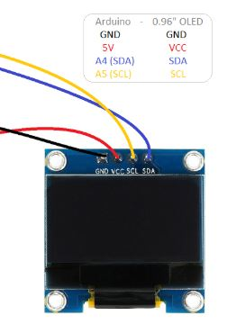
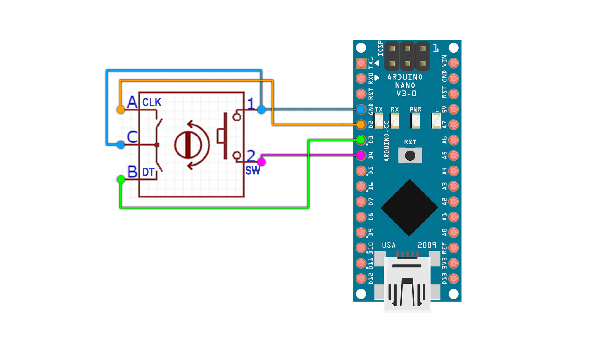
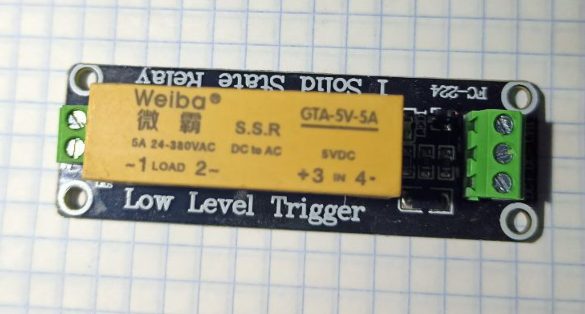

# arduino_timer

## Dependencies

* Encoder lib
https://github.com/AlexGyver/GyverLibs/releases/download/GyverEncoder/GyverEncoder.zip

* OLED driver lib
https://github.com/tremaru/iarduino_OLED_txt/archive/1.1.0.zip

## Hardware

* 0.96 128X64 OLED I2C

* Encoder KY-040

* 1 Channel DC 5V 220V 5A SSR Solid State Relay Module Low Level Trigger

* PC speaker
